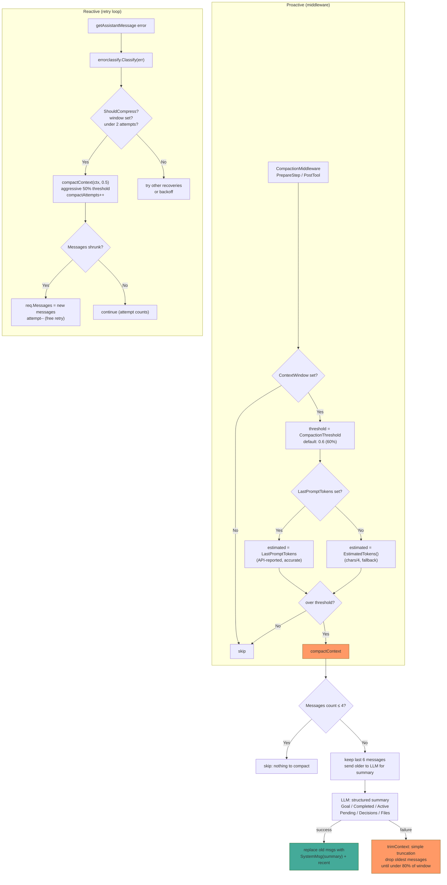
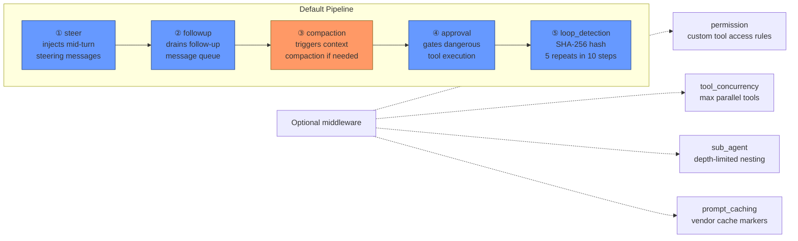

# yaah Agent Loop — Mermaid Diagrams

> Reflects the **current code on `feature/dual-loop`** (HEAD `d28003f`
> plus uncommitted working-tree edits in `internal/agent/agent.go`,
> `cmd/yaah/doctor.go`, and `internal/agent/*_test.go`). The
> working-tree state implements the **always-on dual-loop** design
> from `docs/plans/2026-07-20-dual-loop-executor-always-on.md` (v2),
> which **supersedes** the v1 plan in
> `docs/plans/2026-07-20-dual-loop-executor-owns-tools.md` (whose
> Tasks 1-2 already landed at `86834ac` and `d28003f`).
>
> Diagrams 1 and 6 describe the dual-loop architecture as it stands
> in `internal/agent/agent.go` after the v2 pivot. Diagrams 2-5
> (retry classification, streaming, compaction, middleware order) are
> unchanged by the dual-loop work and are kept verbatim from their
> prior versions.
>
> **Plan pointers** (for the why, not the what):
> - `docs/plans/2026-07-20-dual-loop-executor-owns-tools.md` — v1, gated; first two tasks shipped as `86834ac` and `d28003f`
> - `docs/plans/2026-07-20-dual-loop-executor-always-on.md` — v2, always-on; supersedes v1; matches current working tree
> - `docs/plans/2026-07-20-dual-loop-executor-owns-tools-review.md` — industry survey that informed the v2 pivot
>
> **Code anchors** for Diagram 1 + 6:
> - `runMiddleware` entry: `internal/agent/agent.go:429`
> - dual-loop routing in `Run()`: `internal/agent/agent.go:497-625`
> - `splitDelegateCalls` / `parseDelegateCall` / `lastUserMessage` helpers: `internal/agent/agent.go:684-720`
> - `wrapExecutorResult` envelope: `internal/agent/agent.go:722-735`
> - `runExecutor`: `internal/agent/agent.go:777`
> - `resolveExecutor`: `internal/agent/agent.go:1801`
> - `buildPlannerToolDefs`: `internal/agent/agent.go:1839`
>
> Source files: `internal/agent/agent.go`, `middleware.go`,
> `errorclassify/classify.go`. If code changes, regenerate these
> diagrams.

---

## Diagram 1: Main Agent Loop (`runMiddleware`)

```mermaid
flowchart TD
    START([User submits prompt]) --> INIT[applyDefaults<br/>MaxIterations=50, RetryBackoff=1s]

    INIT --> SESSION{Running session?}

    SESSION -->|No| NEW[Build messages:<br/>SystemMsg + UserMsg]
    SESSION -->|Yes| APPEND[Append UserMsg to<br/>existing messages]

    NEW --> BUILD[buildPipeline:<br/>steer → followup → compaction<br/>→ approval → loop_detection]
    APPEND --> BUILD

    BUILD --> LOOP{"iter < MaxIterations?"}

    LOOP -->|Yes| TURN_START[emitHook: TurnStart<br/>StartTurn span]

    TURN_START --> PREPARE[pipeline.RunPrepareStep<br/>compaction: check LastPromptTokens<br/>steer: inject steering messages<br/>followup: drain follow-up queue]

    PREPARE -->|error| DONE_ERROR[return error]
    PREPARE -->|ok| GET_MSG[getAssistantMessage<br/>streaming or non-streaming<br/>with retry + error classification]

    GET_MSG -->|error| DONE_PROVIDER[return provider error]
    GET_MSG -->|ok| APPEND_MSG[append assistant msg<br/>persistMessage]

    APPEND_MSG --> CHECK_TOOLS{"len(msg.ToolCalls) == 0?"}

    CHECK_TOOLS -->|Yes: final response| FLUSH{streamed and<br/>msg.Content not empty?}
    FLUSH -->|Yes| ON_FLUSH[OnFlush callback]
    FLUSH -->|No| DONE_OK
    ON_FLUSH --> DONE_OK([return msg.Content])

    CHECK_TOOLS -->|No: continue| SPLIT["splitDelegateCalls(msg.ToolCalls)<br/>delegate, inline = split"]

    SPLIT --> SPLIT_PROBE{"any delegate calls?<br/>and/or any inline calls?"}

    %% ── DELEGATE PATH (always-on; planner keeps full tool set + delegate) ──
    SPLIT_PROBE -->|"delegate ≥ 1"| DEL_LOOP[for each delegate call:<br/>parseDelegateCall → directive, execType<br/>originalIntent = lastUserMessage]

    DEL_LOOP --> RUN_EXEC["runExecutor(turnCtx, directive,<br/>originalIntent, execType)<br/>resolveExecutor(execType):<br/>ExecutorProvider if set else main Provider<br/>uses executorSystemPrompt<br/>chains tools up to MaxInnerIterations"]

    RUN_EXEC -->|error| EXEC_ERR[summary = 'executor error: …']
    RUN_EXEC -->|exhausted| EXEC_EXH[summary += 'budget exhausted']
    RUN_EXEC -->|ok| EXEC_OK[summary = terse structured text]

    EXEC_ERR --> TRUNC[if len>maxInnerSummaryLen:<br/>truncateRunes, truncated=true]
    EXEC_EXH --> TRUNC
    EXEC_OK --> TRUNC

    TRUNC --> WRAP["wrapExecutorResult(summary, exhausted, err, truncated)<br/>→ &lt;executor_result state='completed|error|exhausted'<br/>       truncated='true|false'&gt;…&lt;/executor_result&gt;"]

    WRAP --> INJECT_TOOL["inject as tool message:<br/>Role=tool, Name=delegate<br/>ToolCallID=delegateCall.ID<br/>persistMessage"]

    INJECT_TOOL --> NEXT_DEL{more delegate<br/>calls?}
    NEXT_DEL -->|Yes| DEL_LOOP
    NEXT_DEL -->|No| MIXED_CHECK{"also have inline calls?"}

    MIXED_CHECK -->|No: delegate-only turn| TURN_END_DEL["if turnSpan: turnSpan.End()<br/>continue → next iteration"]

    %% ── INLINE PATH (existing single-loop, full middleware) ──
    MIXED_CHECK -->|Yes| EXEC_INLINE[executeAndCollect<br/>run all inline calls in parallel<br/>goroutines + toolSem]
    SPLIT_PROBE -->|"inline ≥ 1<br/>(no delegate)"| EXEC_INLINE

    EXEC_INLINE --> CONFLICT{ConflictTracker?}
    CONFLICT -->|yes + conflicts| INJECT[inject conflict report<br/>as user message]
    CONFLICT -->|no| POST_TOOL
    INJECT --> POST_TOOL[pipeline.RunPostTool<br/>compaction: check LastPromptTokens<br/>after tool results added]

    POST_TOOL -->|error| DONE_ERROR
    POST_TOOL -->|ok| PERSIST[persist new tool result<br/>messages to DB]

    PERSIST --> BUMP[iter++]
    BUMP --> LOOP

    LOOP -->|No: exhausted| MAX_ITER([error: max iterations reached])

    %% ── tool-set annotation (planner sees full + delegate; executor sees full) ──
    PLAN_TOOLS["Planner Tools = buildPlannerToolDefs()<br/>= buildToolDefs() + delegateToolDef()<br/>(additive: always; no gate)"]:::note -.-> SPLIT
    EXEC_TOOLS["Executor Tools = buildToolDefs()<br/>(full registry, no delegate<br/>→ structurally cannot delegate)"]:::note -.-> RUN_EXEC

    classDef note fill:#eee,stroke:#888,color:#333,font-size:11px

    style START fill:#4a9,stroke:#262
    style DONE_OK fill:#4a9,stroke:#262
    style DONE_ERROR fill:#e55,stroke:#622
    style DONE_PROVIDER fill:#e55,stroke:#622
    style MAX_ITER fill:#e55,stroke:#622
    style RUN_EXEC fill:#f96,stroke:#862
    style WRAP fill:#f96,stroke:#862
    style INJECT_TOOL fill:#f96,stroke:#862
```



**Notes on the dual-loop shape (v2 always-on):**

- The planner is exposed to **both** the full registry and `delegate` —
  `buildPlannerToolDefs()` appends `delegateToolDef()` to
  `buildToolDefs()` unconditionally. There is no `dualLoopActive()`
  gate; the planner chooses inline vs. delegate per-action. (Same
  pattern as opencode `task`, crush `agent`.)
- A single turn may contain **both** delegate and inline calls.
  Delegates run through `runExecutor` (own provider/model if
  configured, else the main one — `resolveExecutor` default-model
  fallback). Inline calls go through `executeAndCollect` with the
  full middleware pipeline (approval, conflict tracking, loop
  detection).
- The executor's tool set is `buildToolDefs()` — `delegate` is never
  registered there, so the executor **structurally cannot delegate**
  (recursion guard by schema; analogous to kilocode's
  `nestedTask(): false`).
- The executor's summary is wrapped in an
  `<executor_result state="…" truncated="…">…</executor_result>`
  envelope and injected as a `tool` message whose `Name` is
  `delegateToolName` and `ToolCallID` matches the planner's delegate
  call — the honest tool-result framing.
- `DisableInnerLoop` is removed entirely (it was test-only, never set
  by production code). The dual-loop is unconditional; opt-out, if
  ever needed, would come from per-call configuration.

---

## Diagram 2: getAssistantMessage — Retry & Error Classification


---

## Diagram 3: runStream — SSE Streaming Lifecycle


---

## Diagram 4: Compaction Decision Flow



---

## Diagram 5: Middleware Pipeline Order



---

## Diagram 6: Complete Turn Lifecycle (Sequence)

```mermaid
sequenceDiagram
    participant U as User
    participant L as Loop.RunMiddleware()
    participant M as Middleware
    participant P as Provider (planner)
    participant E as Provider (executor)
    participant X as Executor (runExecutor)
    participant T as Tools
    participant C as errorclassify

    U->>L: prompt

    rect rgb(40, 60, 90)
        Note over L: PrepareStep (middleware)
        L->>M: RunPrepareStep
        M-->>L: compacted/steered messages
    end

    rect rgb(40, 70, 60)
        Note over L: getAssistantMessage retry loop
        loop up to MaxRetries
            L->>P: SendStream / Send<br/>(Tools = buildPlannerToolDefs():<br/>full + delegate, always)
            alt streaming
                P-->>L: SSE chunks (content, reasoning, tool calls)
                L-->>U: OnThinking / OnToken callbacks
            else non-streaming
                P-->>L: ChatResponse
            end

            alt success
                L-->>L: capture usage, set LastPromptTokens
                L->>L: checkTruncatedStream
            else error
                L->>C: Classify(err)
                C-->>L: recovery hints
                alt ShouldCompress
                    L->>L: compactContext at 50%
                else ShouldRotateCred
                    L->>L: swap to fallback provider
                else retryable
                    L->>L: exponential backoff
                else abort
                    L-->>U: error
                end
            end
        end
    end

    L->>L: append assistant msg, persistMessage

    alt final response (no tool calls)
        L-->>U: msg.Content
    else has tool calls

        L->>L: splitDelegateCalls(msg.ToolCalls)<br/>→ delegateCalls, inlineCalls

        rect rgb(120, 80, 30)
            Note over L,X: DELEGATE PATH (always-on)
            loop for each delegate call
                L->>L: parseDelegateCall(args)<br/>→ directive, executorType
                L->>L: originalIntent = lastUserMessage(messages)

                rect rgb(150, 100, 40)
                    Note over X: runExecutor(turnCtx, directive, originalIntent, executorType)<br/>Tools = buildToolDefs() (NO delegate — recursion guard)<br/>SystemPrompt = executorSystemPrompt
                    X->>E: SendStream / Send
                    E-->>X: response (may chain tool calls)
                    loop while has tool calls & iter < MaxInnerIterations
                        X->>T: tool call (executor owns selection)
                        T-->>X: result (appended to executor's msg history)
                        X->>E: next iteration
                        E-->>X: response
                    end
                    X-->>L: summary, exhausted, err
                end

                L->>L: wrapExecutorResult(summary, exhausted, err, truncated)<br/>→ &lt;executor_result state="…" truncated="…"&gt;…
                L->>L: inject as tool message<br/>(Role=tool, Name=delegate,<br/>ToolCallID=delegateCall.ID)<br/>persistMessage<br/>RecordInnerSummary (if OtelVerbose)
            end
        end

        alt no inline calls (delegate-only turn)
            L->>L: turnSpan.End(); continue → next iteration
            Note over L: skips PostTool/conflict middleware<br/>(no inline tool results to process)
        else has inline calls
            rect rgb(90, 60, 40)
                Note over L: INLINE PATH (existing single-loop)
                L->>T: parallel goroutines — each inline tool
                T-->>L: tool results
            end

            opt conflict detected
                L->>L: inject conflict report as user msg
            end

            rect rgb(40, 60, 90)
                Note over L: PostTool (middleware)
                L->>M: RunPostTool
                M-->>L: compacted messages
            end

            Note over L: iter++, loop continues
        end
    end
```

**Notes on the dual-loop sequence:**

- The planner's `SendStream`/`Send` always uses
  `buildPlannerToolDefs()` — the planner sees the full registry
  *plus* `delegate` unconditionally. There's no gate.
- Delegate calls run **before** inline calls within a turn, but
  both can coexist. The two paths share the same outer-loop turn
  counter (`iter++`) but otherwise have different observability
  surfaces: delegates produce `inner.loop` spans (executor side),
  inline calls produce the outer `agent.turn` tool spans.
- The executor's tool set is `buildToolDefs()` (full registry only)
  — `delegate` is never present in the executor's `Tools` array, so
  the executor structurally cannot delegate.
- The executor's final summary flows back as a `tool` message whose
  `Name` is `delegateToolName` and whose `ToolCallID` matches the
  planner's original `delegate` call — the honest tool-result
  framing that satisfies the OpenAI requirement that every
  assistant `tool_calls` be followed by matching `tool` messages.
- `wrapExecutorResult` emits a structured XML envelope
  (`<executor_result state="…" truncated="…">…</executor_result>`)
  so downstream consumers (TUI, middleware, composability code) can
  programmatically detect state — mirrors opencode's
  `<task id="…" state="…">` wrapping.
- Delegate-only turns skip the conflict-tracking and PostTool
  middleware (no inline tool results to process). Mixed turns
  (delegate + inline) run both paths and process the inline results
  through the full middleware pipeline.

---

## Error Classification Recovery Hints


