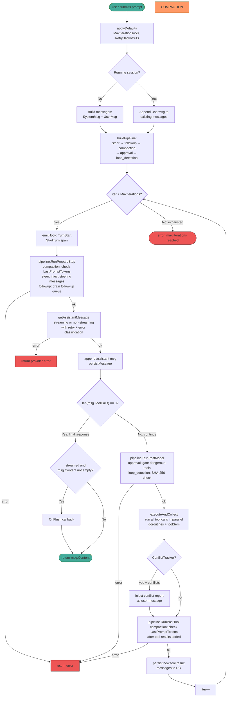
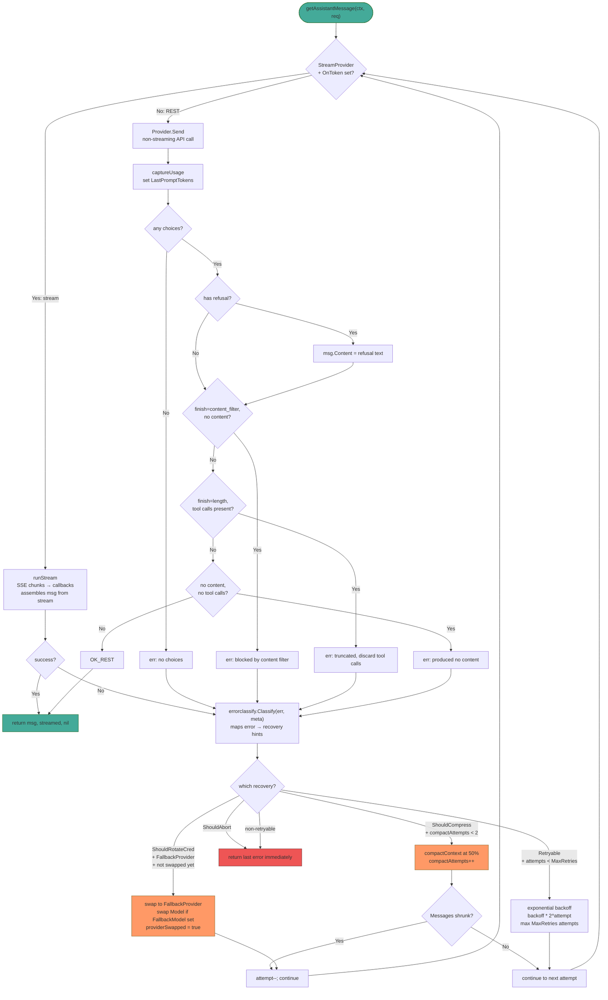
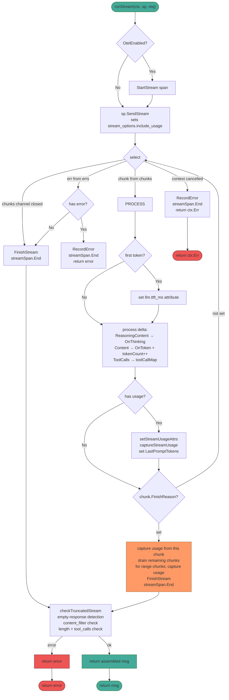
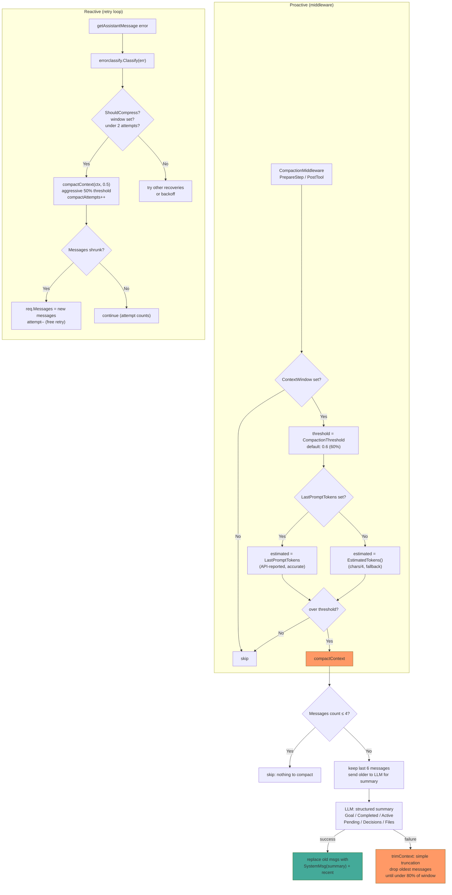
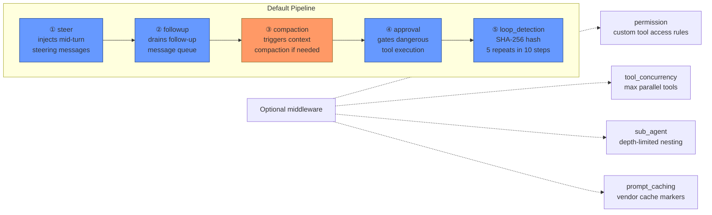
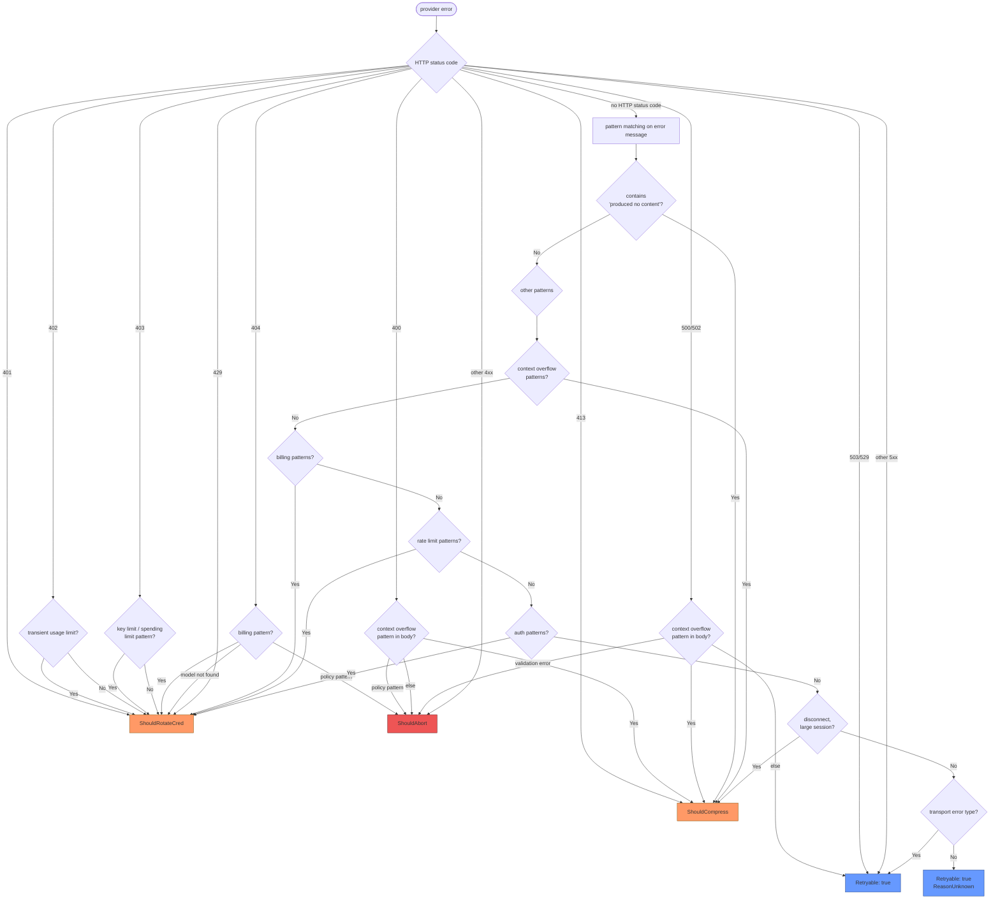

# yaah Agent Loop — Mermaid Diagrams

> Auto-generated from current code (`internal/agent/agent.go`, `middleware.go`, `errorclassify/classify.go`).
> If code changes, regenerate these diagrams.

---

## Diagram 1: Main Agent Loop (`runMiddleware`)

---

## Diagram 2: getAssistantMessage — Retry & Error Classification

---

## Diagram 3: runStream — SSE Streaming Lifecycle

---

## Diagram 4: Compaction Decision Flow

---

## Diagram 5: Middleware Pipeline Order

---

## Diagram 6: Complete Turn Lifecycle (Sequence)

```mermaid
sequenceDiagram
    participant U as User
    participant L as Loop.Run()
    participant M as Middleware
    participant P as Provider
    participant E as errorclassify
    participant T as Tools

    U->>L: prompt

    rect rgb(40, 60, 90)
        Note over L: PrepareStep (middleware)
        L->>M: RunPrepareStep
        M-->>L: compacted/steered messages
    end

    rect rgb(40, 70, 60)
        Note over L: getAssistantMessage retry loop<br/>involves Provider + errorclassify
        loop up to MaxRetries
            L->>P: SendStream / Send
            alt streaming
                P-->>L: SSE chunks (content, reasoning, tool calls)
                L-->>U: OnThinking / OnToken callbacks
            else non-streaming
                P-->>L: ChatResponse
            end

            alt success
                L-->>L: capture usage, set LastPromptTokens
                L->>L: checkTruncatedStream (empty? content_filter? length?)
            else error
                L->>E: Classify(err)
                E-->>L: recovery hints
                alt ShouldCompress
                    L->>L: compactContext at 50%
                    Note over L: attempt-- (free retry)
                else ShouldRotateCred
                    L->>L: swap to fallback provider
                    Note over L: attempt-- (free retry)
                else retryable
                    L->>L: exponential backoff
                else abort
                    L-->>U: error
                end
            end
        end
    end

    alt final response (no tool calls)
        L-->>U: msg.Content
    else has tool calls
        rect rgb(90, 60, 40)
            Note over L: PostModel (middleware)
            L->>M: RunPostModel
            M-->>L: approval gating, loop detection
        end

        rect rgb(60, 60, 40)
            Note over L: Tool Execution
            par parallel goroutines
                L->>T: tool A
            and
                L->>T: tool B
            and
                L->>T: tool C
            end
            T-->>L: results
        end

        alt conflict detected
            L->>L: inject conflict report as user msg
        end

        rect rgb(40, 60, 90)
            Note over L: PostTool (middleware)
            L->>M: RunPostTool
            M-->>L: compacted messages
        end

        Note over L: iter++, loop continues
    end
```

---

## Error Classification Recovery Hints

